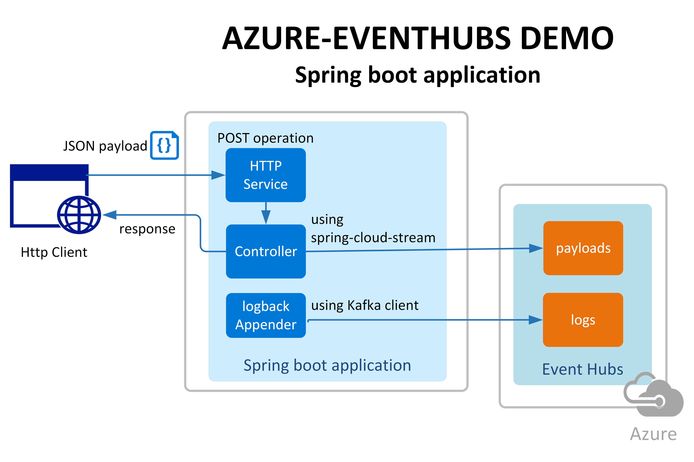
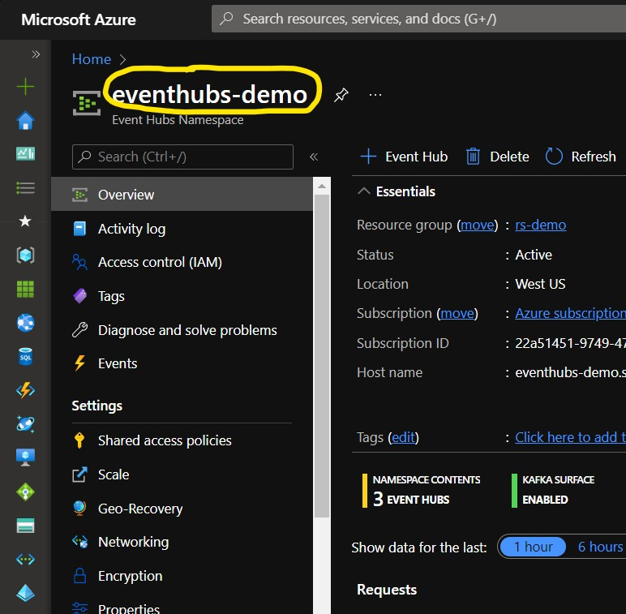
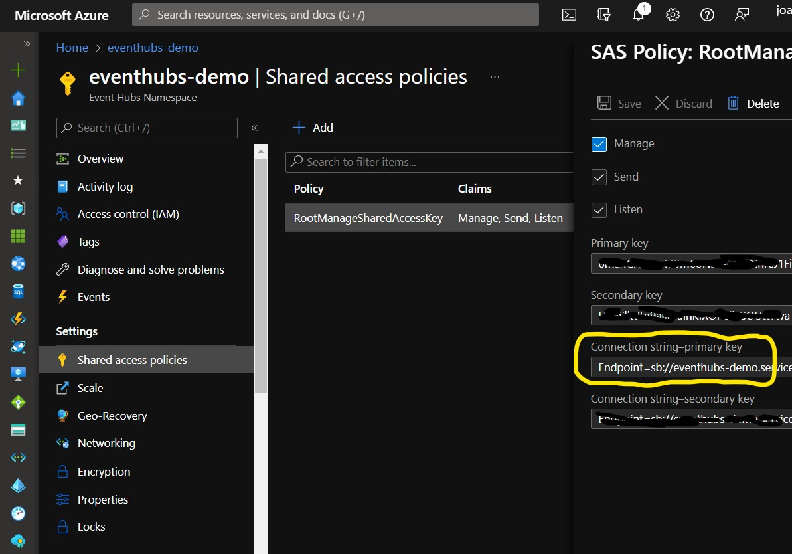
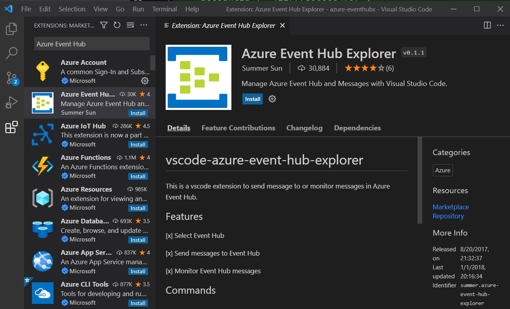
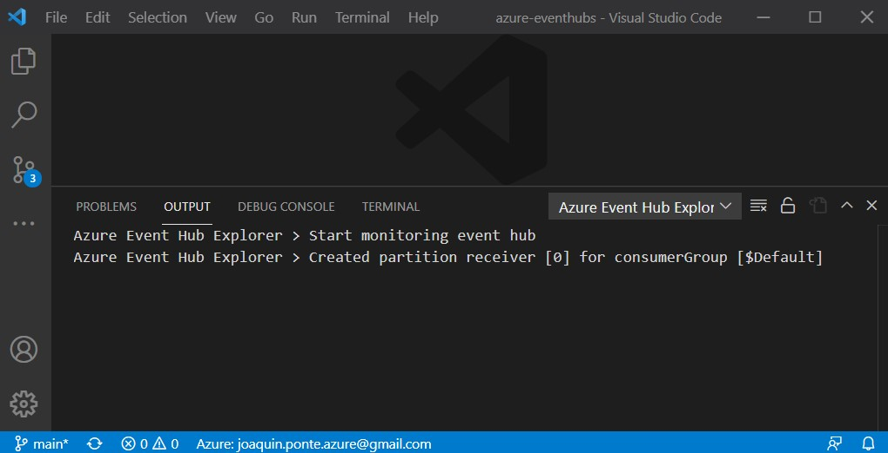
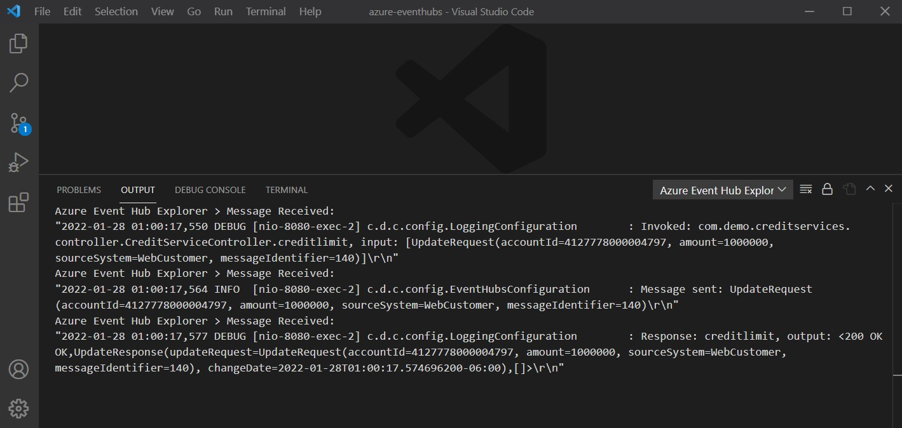
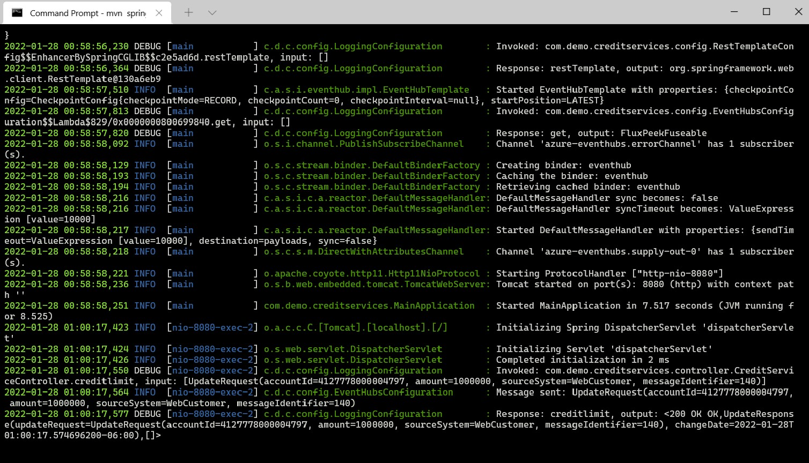

# azure-eventhubs
*Microsoft Azure Event Hubs demo with Spring Boot 2.6.3. Implemented features: Logback Appender & Event Producer*

## Table of contents
1. [Objectives](#Objectives)
2. [Prerequisites](#prerequisites)
3. [Environment variables](#environment-variables)
4. [Build and test the application](#build-and-test-the-application)
5. [Reading messages from Event Hubs](#reading-messages-from-event-hubs)
6. [Recommended content](#recommended-content)

## Objectives
1. Send application logs to Azure Event Hubs implementing a Logback appender.
2. Producing events with Spring Cloud Stream to Azure Event Hubs.

The next image depicts the architecture of the application:

## Prerequisites
* An Azure subscription
* Java Development Kit (JDK) 11
* Apache Maven, version 3.8 or later.
* An Event Hubs standard instance (for the use case of logging with the Kafka API)
* 2 Event Hub's (topics), one for storing the log messages and other to store the message payloads received in the web service 

## Environment variables
The application requires the next environment variables:
* EVENTHUBS_NAMESPACE. The management container for event hubs (or topics, in Kafka parlance).
* EVENTHUBS_CONNECTION. The connection string for Event Hubs
* EVENTHUBS_LOGGING_EVENTHUB. The name of the Event Hub used to store the logging messages

Example:
~~~bash
set EVENTHUBS_CONNECTION=Endpoint=sb://my-eventhubs.servicebus.windows.net/;SharedAccessKeyName=RootManageSharedAccessKey;SharedAccessKey=aabbccddeeffgghhhiii= 
set EVENTHUBS_NAMESPACE=my-eventhubs
set EVENTHUBS_LOGGING_EVENTHUB=logs
~~~
### Getting the namespace
1. Browse to the Azure portal at https://portal.azure.com/ and sign in.
2. Select **All resources**, then search for Event Hubs Namespace

   

### Getting the connection string
1. Browse to the Azure portal at https://portal.azure.com/ and sign in.
2. Select **All resources**, then search for Event Hubs Namespace
3. On the Event Hubs Namespace page, select on the left sidebar menu the option **Shared access policies**
4. Select **RootManageSharedAccessKey** and copy the Connection string-primary key
   

## Build and test the application

Build your Spring Boot application with Maven and run it; for example:
~~~bash
mvn clean package -Dmaven.test.skip=true
mvn spring-boot:run
~~~

Once your application is running, you can use CURL to test the application, for example (using line continuation character for windows):
~~~bash
curl --location --request POST 'http://localhost:8080/creditlimit' ^
--header 'Content-Type: application/json' ^
--header 'charset: ISO-8859-1' ^
--data-raw '{
    "accountId": "4127778000004797",
    "amount": "1000000",
    "sourceSystem": "WebCustomer",
    "messageIdentifier": "137"
}'
~~~

You should see a similar json response in the client:
~~~json
{
   "updateRequest": {
      "accountId": "4127778000004797",
      "amount": "1000000",
      "sourceSystem": "WebCustomer",
      "messageIdentifier": "136"
   },
   "changeDate": "2022-01-27T10:15:43.0286947-06:00"
}
~~~

## Reading messages from Event Hubs
Using VisualStudio Code We can get the messages sent to the logging Event Hub. Install the Azure Event Hub Explorer:

Configure the Event Hub connection. From the command palette (Ctrl-Shift-P) select the operation:
>EventHub: Select Event Hub

Then command will ask for:
* The Azure subscription
* The resource group
* The namespace
* The event hub

Monitor the incoming message sent to Event Hub. From the command palette (Ctrl-Shift-P) select:
>EventHub: Start Monitoring Event Hub Message
 

[Test the application](#build-and-test-the-application), and you should see the messages in VisualStudio Code:

The logging messages must be the same as the spring console:

## Recommended content
* [Use Azure Event Hubs from Apache Kafka applications](https://docs.microsoft.com/en-us/azure/event-hubs/event-hubs-for-kafka-ecosystem-overview)
* [How to create a Spring Cloud Stream Binder application with Azure Event Hubs](https://docs.microsoft.com/en-us/azure/developer/java/spring-framework/configure-spring-cloud-stream-binder-java-app-azure-event-hub)
* [Integrate Event Hubs with serverless functions on Azure](https://docs.microsoft.com/en-us/azure/architecture/serverless/event-hubs-functions/event-hubs-functions)
* [Features and terminology in Azure Event Hubs](https://docs.microsoft.com/en-us/azure/event-hubs/event-hubs-features)
